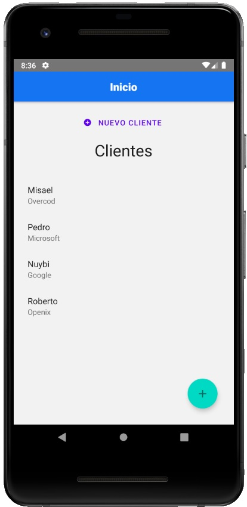

# App para hacer un CRUD de usuarios utilizando React Native

## Herramientas utilizadas:
- React Native Paper
- React Native Navigation
- JSON Server

## Pasos a seguir:
- Debe tener previamente instalado json-server:
`npm install -g json-server`

- Iniciar el servidor JSON:
`json-server db.json`

- Para comenzar ejecute:
`npm install`

- Para correr en el emulador o en su celular ejecute (android):
`npx react-native run-android`

- Para correr en el emulador o en su celular ejecute (ios):
`npx react-native run-ios`

## Vista Previa:

